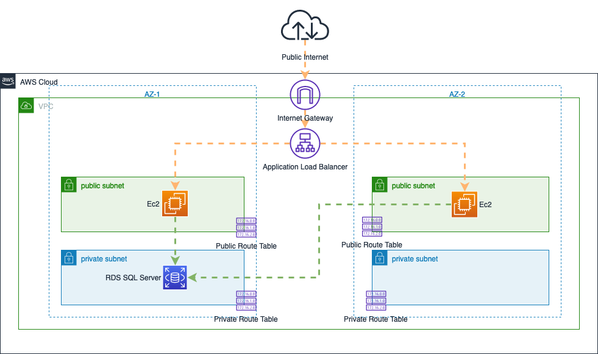

# Genesis challenge

author: Patrick Malatesta

date: 12 April 2023

---

## Architecture Diagram


---

## Prerequisites

To deploy the resource you will need:

- [Git](https://git-scm.com/book/en/v2/Getting-Started-Installing-Git) installed.
- The [Terraform CLI (1.2.0+)](https://developer.hashicorp.com/terraform/tutorials/aws-get-started/install-cli) installed.
- The [AWS CLI](https://docs.aws.amazon.com/cli/latest/userguide/install-cliv2.html) installed.
- [AWS account](https://aws.amazon.com/free) and [associated credentials](https://docs.aws.amazon.com/general/latest/gr/aws-sec-cred-types.html) that allow you to create resources.

---

## Input variables

You can customize the deployment by modifying the following variables. 

You can pass the desired values with either of the following methods:

- [on the command line](https://developer.hashicorp.com/terraform/language/values/variables#variables-on-the-command-line)
- [by creating a `.tfvars` file](https://developer.hashicorp.com/terraform/language/values/variables#variables-on-the-command-line)
- [using environment variables](https://developer.hashicorp.com/terraform/language/values/variables#variables-on-the-command-line)


| Variable Name        | Description                                                | Type   | Default Value |
|----------------------|------------------------------------------------------------|--------|---------------|
| *region*               | Name of the AWS Region where resources will be created     | string | eu-west-1     |
| *az_number*          | Number of AZs in use                                       | number | 2             |
| *os*                | Operating system of the Ec2 instance                       | string | Linux         |
| *instance_count*       | Number of Ec2 instance to be created                       | number | 1             |
| *ec2_ebs_volume_count* | Number of hard drive volumes attached to each Ec2 instance | number | 2             |
| *database_class*       | SQL Server Database engine class                           | string | db.t3.medium  |

---

## Deploy to different AWS Account representing different environments (DEV, QA, STAGING, PROD)

By default the resources will be deployed in the AWS account matching the AWS credentials stored locally. This is assumed to be the `DEV` environment/account.

If you want to deploy to a different environment/AWS account you can modify the `providers` sections in the file [`main.tf`](main.tf) for all the modules. For example, if you want to deploy to the `PROD` environment you would set the `providers` attribute `aws = aws.PROD` for all the modules in the file [`main.tf`](main.tf):

```
# additional module configuration
... 
  providers = {
    aws = aws.PROD 
  }
...
# additional module configuration
```

NOTE: this approach uses the [provider `assume_role` option](https://registry.terraform.io/providers/hashicorp/aws/latest/docs#assuming-an-iam-role) the Terraform AWS Provider will attempt to assume the specified role using the supplied credentials. This method increases security as credentials are not hardcoded and passed as variables. 

The requirement for this is that IAM roles in the target account (QA, STAGING, PROD) already exist and that the local AWS credentials allow to assume those roles. The IAM role ARNs need to be specified in the file [`provider.tf`](provider.tf) like in the example below:

```
# additional provider configuration
...
  assume_role {
    role_arn     = "arn:aws:iam::<PROD_ACCOUNT_ID>:role/<PROD_ROLE_NAME>"
    session_name = "prod_account"
  }
...
# additional provider configuration
```

For more details about this method you can refer to [this tutorial](https://developer.hashicorp.com/terraform/tutorials/aws/aws-assumerole)

---

## Installation steps

1 - clone the repository

```
$ git clone https://github.com/malatep/genesis_challenge.git
```

2 - navigate to the project directory
```
$ cd genesis_challenge
```
3 - initialize terraform 
```
$ terraform init
```
4 - plan the deployment
```
$ terraform plan
```
5 - deploy the infrastructure
```
$ terraform apply
```
6 - clean up the resources
```
$ terraform destroy
```

